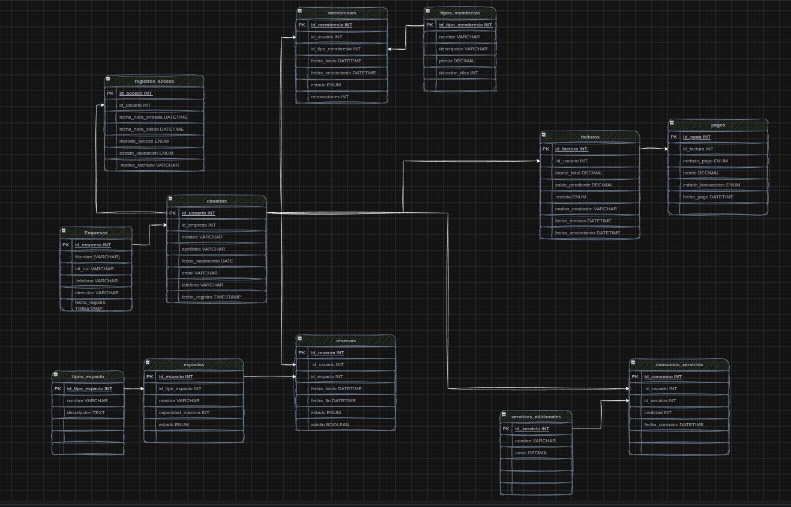

# ID 1791 · Gestión de Coworking y Oficinas Compartidas


Base de datos relacional en **MySQL 8.0** para administrar un coworking: membresías, reservas de espacios, facturación y pagos, control de acceso, auditoría automática y seguridad por roles.

---

## Tabla de contenido

1. [Descripción del proyecto](#1-descripción-del-proyecto)
2. [Requisitos del sistema](#2-requisitos-del-sistema)
3. [Instalación y configuración](#3-instalación-y-configuración)
4. [Estructura de la base de datos](#4-estructura-de-la-base-de-datos)
5. [Ejemplos de consultas](#5-ejemplos-de-consultas)
6. [Módulos avanzados](#6-módulos-avanzados)
7. [Roles y permisos](#7-roles-y-permisos)
8. [Licencia y contacto](#8-licencia-y-contacto)

---

## 1. Descripción del proyecto

### Objetivo

Diseñar e implementar la capa de datos completa de un sistema de gestión de coworking: modelo relacional normalizado, carga de datos de prueba, consultas analíticas, lógica de negocio en el servidor (funciones, procedimientos, triggers y eventos) y un modelo de seguridad basado en roles con mínimo privilegio.

### Contexto del negocio

Un coworking alquila espacios y servicios a profesionales y empresas:

- **Espacios:** escritorios flexibles, oficinas privadas, salas de reuniones y salas de eventos.
- **Membresías:** `Diaria`, `Mensual`, `Corporativa` y `Premium`, con precio y duración propios.
- **Reservas:** cada reserva nace como *Pendiente de Confirmación*, se confirma al pagarse su factura y puede cancelarse, con reembolso, o terminar en *No Show*.
- **Servicios adicionales:** internet premium, lockers, café ilimitado, impresiones, proyector.
- **Facturación:** facturas de membresía, de reserva y consolidadas por empresa, con pagos parciales, recargos por mora y reembolsos.
- **Acceso físico:** ingreso y salida por **QR** o **RFID**, validado contra la membresía o la reserva vigente.

### Reglas de negocio transversales

| Regla | Definición |
|---|---|
| Ingreso real | Pagos con `estado_transaccion = 'Pagado'`. Los reembolsos son pagos de **monto negativo**, por lo que el ingreso neto es un `SUM` simple. |
| Reserva válida | Cualquier reserva distinta de `Cancelada`. |
| Asistencia | Registro en `registros_acceso` con `estado_validacion = 'Exitoso'`. |
| Membresía vigente | Estado `Activa` y `NOW()` entre `fecha_inicio` y `fecha_vencimiento`. |

---

## 2. Requisitos del sistema

| Componente | Requisito |
|---|---|
| Motor | **MySQL Server 8.0 o superior** (se usan roles, *window functions*, CTE, `CREATE OR REPLACE VIEW`, `FAILED_LOGIN_ATTEMPTS`, columnas generadas, tipo `JSON`). |
| Cliente | **MySQL Workbench 8.0+** o **MySQL CLI** (`mysql`). |
| Privilegios | Cuenta con permisos para crear bases, rutinas, triggers, eventos, roles y usuarios (por ejemplo, `root`). |
| Planificador | `event_scheduler = ON` (el script de eventos lo activa; para que persista tras reiniciar, configúrelo en `my.cnf`). |
| Codificación | Archivos en **UTF-8** (hay valores con tilde, como `Pendiente de Confirmación`). |

---

## 3. Instalación y configuración

### 3.1 Clonar el repositorio

```bash
git clone https://github.com/<organizacion>/coworking-mysql2-grupoXX.git
cd coworking-mysql2-grupoXX
```

### 3.2 Estructura del repositorio

```
coworking-mysql2-grupoXX/
├── README.md
├── docs/
│   ├── modelo_logico.png
│   └── roles_permisos.md
└── sql/
    ├── 00_ddl/01_estructura.sql
    ├── 01_dml/01_datos_iniciales.sql
    ├── 02_consultas/            (01 a 05)
    ├── 03_funciones/01_funciones.sql
    ├── 04_procedimientos/01_procedimientos.sql
    ├── 05_triggers/01_triggers.sql
    ├── 06_eventos/01_eventos.sql
    └── 07_seguridad/            (01_roles, 02_permisos, 03_usuarios)
```

### 3.3 Despliegue secuencial

> ⚠️ **El orden importa.** Los triggers modifican el estado inicial de reservas y pueden convertir accesos en `Rechazado`; por eso los datos (DML) se cargan **antes** de crear los triggers.
>
> ⚠️ `01_estructura.sql` ejecuta `DROP DATABASE IF EXISTS coworking_db`. **Borra la base existente.**

| Paso | Archivo | Qué hace |
|---|---|---|
| 1 | `sql/00_ddl/01_estructura.sql` | Crea la base `coworking_db`, las 18 tablas y los índices. |
| 2 | `sql/01_dml/01_datos_iniciales.sql` | Carga catálogos y datos de prueba. |
| 3 | `sql/03_funciones/01_funciones.sql` | Crea las 20 funciones `fn_*`. |
| 4 | `sql/04_procedimientos/01_procedimientos.sql` | Crea los 20 procedimientos `sp_*`. |
| 5 | `sql/05_triggers/01_triggers.sql` | Agrega `usuarios.ultimo_acceso` y crea los 20 triggers `trg_*`. |
| 6 | `sql/06_eventos/01_eventos.sql` | Activa el planificador, crea 6 tablas auxiliares y los 20 eventos `evt_*`. |
| 7 | `sql/07_seguridad/01_roles.sql` → `02_permisos.sql` → `03_usuarios.sql` | Roles, privilegios (con vistas de seguridad) y usuarios de ejemplo. |
| Opcional | `sql/02_consultas/01…05` | Consultas de ejemplo; pueden ejecutarse en cualquier momento después del paso 2. |

### 3.4 Opción A: MySQL CLI

```bash
# Desde la raíz del repositorio
for f in \
  sql/00_ddl/01_estructura.sql \
  sql/01_dml/01_datos_iniciales.sql \
  sql/03_funciones/01_funciones.sql \
  sql/04_procedimientos/01_procedimientos.sql \
  sql/05_triggers/01_triggers.sql \
  sql/06_eventos/01_eventos.sql \
  sql/07_seguridad/01_roles.sql \
  sql/07_seguridad/02_permisos.sql \
  sql/07_seguridad/03_usuarios.sql
do
  echo ">> Ejecutando $f"
  mysql -u root -p --default-character-set=utf8mb4 < "$f" || { echo "Error en $f"; break; }
done
```

El cliente `mysql` interpreta `DELIMITER` por sí mismo, por lo que no hace falta ajuste adicional.

### 3.5 Opción B: MySQL Workbench

1. Conéctese con una cuenta administradora.
2. Menú **File → Run SQL Script…** y seleccione cada archivo en el orden de la tabla anterior.
3. Verifique que *Default Character Set* sea `utf8mb4` y revise la pestaña *Output* después de cada script.

### 3.6 Ajustes posteriores

- **`sql/07_seguridad/03_usuarios.sql`:** cambie las contraseñas de ejemplo y los correos `@email_cliente` y `@email_gerente` por correos existentes en la tabla `usuarios` (vinculan las cuentas con las vistas de seguridad por fila).
- **Planificador persistente:** agregue en `my.cnf` / `my.ini`:

  ```ini
  [mysqld]
  event_scheduler = ON
  ```

### 3.7 Verificación de la instalación

```sql
USE coworking_db;

SELECT COUNT(*) AS tablas FROM information_schema.TABLES
 WHERE TABLE_SCHEMA = 'coworking_db' AND TABLE_TYPE = 'BASE TABLE';   -- 25 (18 del modelo + 6 de eventos + 1 de seguridad)

SELECT ROUTINE_TYPE, COUNT(*) AS total FROM information_schema.ROUTINES
 WHERE ROUTINE_SCHEMA = 'coworking_db' GROUP BY ROUTINE_TYPE;         -- FUNCTION 20, PROCEDURE 21 (20 + sp_mi_crear_reserva)

SELECT COUNT(*) AS triggers FROM information_schema.TRIGGERS
 WHERE TRIGGER_SCHEMA = 'coworking_db';                               -- 20

SELECT COUNT(*) AS eventos FROM information_schema.EVENTS
 WHERE EVENT_SCHEMA = 'coworking_db';                                 -- 20

SELECT COUNT(*) AS vistas FROM information_schema.VIEWS
 WHERE TABLE_SCHEMA = 'coworking_db';                                 -- 15
```

---

## 4. Estructura de la base de datos

Modelo lógico: [`docs/modelo_logico.png`](docs/modelo_logico.png)



El modelo base contiene **18 tablas** en cinco módulos.

### 4.1 Tablas maestras y catálogos (4)

| Tabla | Descripción |
|---|---|
| `empresas` | Empresas clientes (`nit_ruc` único). |
| `tipos_membresia` | Diaria, Mensual, Corporativa, Premium: precio y duración en días. |
| `tipos_espacio` | Escritorios flexibles, oficinas privadas, salas de reuniones y de eventos. |
| `servicios_adicionales` | Internet premium, lockers, café, impresiones, proyector; con costo e indicador `bloqueado`. |

### 4.2 Entidades principales (6)

| Tabla | Descripción |
|---|---|
| `usuarios` | Personas registradas; pueden pertenecer a una empresa (`id_empresa` opcional). |
| `espacios` | Espacios físicos con capacidad, horario y estado (`Disponible`, `Mantenimiento`, `Inactivo`). |
| `membresias` | Membresía de un usuario: vigencia, estado (`Activa`, `Suspendida`, `Vencida`) y renovaciones. |
| `reservas` | Reserva de un espacio: `Pendiente de Confirmación`, `Confirmada`, `Cancelada`, `No Show`. |
| `reserva_servicios` | Servicios adicionales incluidos en una reserva. |
| `consumos_servicios` | Consumo de servicios adicionales por usuario. |

### 4.3 Facturación y pagos (3)

| Tabla | Descripción |
|---|---|
| `facturas` | Cabecera: monto, saldo pendiente, estado (`Pendiente`, `Pagada`, `Anulada`, `Vencida`), vínculo opcional a membresía o reserva. |
| `detalle_facturas` | Líneas de la factura; `subtotal` es una columna generada (`cantidad × precio_unitario`). |
| `pagos` | Pagos por factura: método (`Efectivo`, `Tarjeta`, `Transferencia`, `PayPal`) y estado de la transacción. |

### 4.4 Control de acceso (1)

| Tabla | Descripción |
|---|---|
| `registros_acceso` | Entradas y salidas por `QR` o `RFID`, con resultado de validación y motivo de rechazo. |

### 4.5 Auditoría y logs (4)

| Tabla | Alimentada por |
|---|---|
| `log_cambios_membresia` | `trg_upd_membresia_log` (cambios de tipo de membresía). |
| `log_reservas_canceladas` | `trg_upd_reserva_cancelada_log`. |
| `log_pagos_anulados` | `trg_upd_pago_anulado_log`. |
| `log_accesos_rechazados` | `trg_ins_acceso_rechazado_log`. |

### 4.6 Objetos adicionales creados por los scripts

| Origen | Objetos |
|---|---|
| `05_triggers` | Columna `usuarios.ultimo_acceso` (la mantiene `trg_ins_acceso_ultima_fecha`). |
| `06_eventos` | Tablas `log_eventos_ejecucion`, `notificaciones_sistema`, `reportes_automaticos` (JSON), `archivo_reservas_no_asistidas`, `top_usuarios_frecuentes_mensual`, `usuarios_servicios_bloqueados`. |
| `07_seguridad` | Tabla `seg_mapeo_cuentas`, 15 vistas de seguridad/reportes y el procedimiento `sp_mi_crear_reserva`. |

---

## 5. Ejemplos de consultas

Los siguientes ejemplos son ilustrativos y funcionan sobre el esquema; las consultas del proyecto están en [`sql/02_consultas/`](sql/02_consultas).

### 5.1 Básica: membresías vigentes y próximas a vencer

```sql
SELECT u.id_usuario,
       CONCAT(u.nombre, ' ', u.apellidos) AS usuario,
       tm.nombre                          AS tipo_membresia,
       m.fecha_vencimiento,
       DATEDIFF(m.fecha_vencimiento, NOW()) AS dias_restantes
  FROM membresias m
  INNER JOIN usuarios u         ON u.id_usuario = m.id_usuario
  INNER JOIN tipos_membresia tm ON tm.id_tipo_membresia = m.id_tipo_membresia
 WHERE m.estado = 'Activa'
   AND NOW() BETWEEN m.fecha_inicio AND m.fecha_vencimiento
 ORDER BY m.fecha_vencimiento;
```

**Explicación:** une membresías con usuarios y tipos, filtra las vigentes según la regla de negocio y las ordena por vencimiento para priorizar renovaciones.

### 5.2 Intermedia: ocupación por espacio

```sql
SELECT te.nombre AS tipo_espacio,
       e.nombre  AS espacio,
       COUNT(r.id_reserva) AS total_reservas,
       COALESCE(ROUND(SUM(TIMESTAMPDIFF(MINUTE, r.fecha_inicio, r.fecha_fin)) / 60, 2), 0) AS horas_reservadas
  FROM espacios e
  INNER JOIN tipos_espacio te ON te.id_tipo_espacio = e.id_tipo_espacio
  LEFT JOIN  reservas r       ON r.id_espacio = e.id_espacio
                             AND r.estado <> 'Cancelada'
 GROUP BY te.nombre, e.id_espacio, e.nombre
 ORDER BY horas_reservadas DESC;
```

**Explicación:** el `LEFT JOIN` conserva los espacios sin reservas (aparecen con 0). La condición `estado <> 'Cancelada'` va en el `ON`, no en el `WHERE`, para no eliminar esos espacios. Las horas se calculan con `TIMESTAMPDIFF`.

### 5.3 Avanzada (Window Functions): ingresos mensuales, acumulado y variación

```sql
WITH ingresos_mensuales AS (
    SELECT DATE_FORMAT(fecha_pago, '%Y-%m') AS periodo,
           SUM(monto)                        AS ingreso_neto
      FROM pagos
     WHERE estado_transaccion = 'Pagado'
     GROUP BY DATE_FORMAT(fecha_pago, '%Y-%m')
)
SELECT periodo,
       ingreso_neto,
       SUM(ingreso_neto) OVER (ORDER BY periodo)                       AS acumulado,
       LAG(ingreso_neto) OVER (ORDER BY periodo)                       AS mes_anterior,
       ROUND(
         (ingreso_neto - LAG(ingreso_neto) OVER (ORDER BY periodo))
         / NULLIF(LAG(ingreso_neto) OVER (ORDER BY periodo), 0) * 100, 2
       )                                                               AS variacion_pct
  FROM ingresos_mensuales
 ORDER BY periodo;
```

**Explicación:** una CTE calcula el ingreso neto por mes (los reembolsos, al ser negativos, ya restan). `SUM() OVER` produce el acumulado, y `LAG()` permite comparar con el mes anterior; `NULLIF` evita la división por cero.

### 5.4 Avanzada (Window Functions): ranking de asistencia por empresa

```sql
SELECT COALESCE(e.nombre, 'Sin empresa') AS empresa,
       CONCAT(u.nombre, ' ', u.apellidos) AS usuario,
       COUNT(*) AS asistencias,
       RANK() OVER (PARTITION BY u.id_empresa ORDER BY COUNT(*) DESC) AS posicion_en_empresa
  FROM registros_acceso ra
  INNER JOIN usuarios u ON u.id_usuario = ra.id_usuario
  LEFT  JOIN empresas e ON e.id_empresa = u.id_empresa
 WHERE ra.estado_validacion = 'Exitoso'
 GROUP BY u.id_usuario, u.id_empresa, e.nombre, u.nombre, u.apellidos
 ORDER BY empresa, posicion_en_empresa;
```

**Explicación:** cuenta las asistencias (accesos exitosos) por usuario y usa `RANK() OVER (PARTITION BY …)` para numerar a los usuarios dentro de cada empresa.

---

## 6. Módulos avanzados

### 6.1 Funciones almacenadas (20, prefijo `fn_`)

Todas son `NOT DETERMINISTIC READS SQL DATA`. Las agregaciones devuelven `0` sin datos; las que devuelven un id o fecha devuelven `NULL`.

| Categoría | Funciones |
|---|---|
| Membresías | `fn_membresia_activa`, `fn_dias_restantes_membresia`, `fn_tipo_membresia`, `fn_renovaciones_membresia`, `fn_estado_membresia` |
| Reservas | `fn_total_reservas`, `fn_horas_reservadas`, `fn_espacio_mas_reservado`, `fn_reservas_activas`, `fn_duracion_promedio_reservas` |
| Pagos y facturación | `fn_total_pagado`, `fn_ingresos_por_mes`, `fn_ingresos_por_membresias`, `fn_ingresos_por_reservas`, `fn_ingresos_por_empresa` |
| Accesos y asistencias | `fn_total_asistencias`, `fn_asistencias_mes`, `fn_top_usuario_asistencias`, `fn_ultima_asistencia`, `fn_promedio_asistencias` |

```sql
SELECT fn_membresia_activa(1), fn_dias_restantes_membresia(1), fn_tipo_membresia(1);
SELECT fn_horas_reservadas(1, 9, 2026), fn_ingresos_por_mes(9, 2026);
```

### 6.2 Procedimientos almacenados (20, prefijo `sp_`)

Los errores de negocio se señalan con `SIGNAL SQLSTATE '45000'`. Los que modifican varias tablas usan transacción y un `EXIT HANDLER` con `ROLLBACK` y `RESIGNAL`.

| Módulo | Procedimientos |
|---|---|
| Membresías | `sp_registrar_membresia`, `sp_renovar_membresia`, `sp_actualizar_membresias_vencidas`, `sp_suspender_membresias_morosas` |
| Reservas | `sp_validar_disponibilidad_espacio`, `sp_crear_reserva`, `sp_confirmar_reserva_pago`, `sp_cancelar_reserva_reembolso`, `sp_liberar_reservas_pendientes` |
| Facturación | `sp_generar_factura_membresia`, `sp_generar_factura_empresa`, `sp_aplicar_recargo_facturas_vencidas`, `sp_bloquear_servicios_impago` |
| Accesos | `sp_registrar_acceso_entrada`, `sp_registrar_acceso_salida`, `sp_reporte_diario_asistencias` |
| Especiales | `sp_marcar_no_show_penalizar`, `sp_registrar_lote_empleados` (JSON, todo o nada), `sp_cancelar_reservas_usuario_eliminado`, `sp_reporte_ingresos_acumulados` |

```sql
CALL sp_crear_reserva(1, 2, '2026-10-05 09:00:00', '2026-10-05 11:00:00');
CALL sp_cancelar_reserva_reembolso(10, 50.00);   -- reembolsa el 50 % de lo pagado
```

### 6.3 Triggers (20, prefijo `trg_`)

Garantizan integridad y auditoría. Encadenan el flujo de pagos: `INSERT pagos → saldo de la factura → factura 'Pagada' → membresía/reserva se activa o confirma`.

| Módulo | Trigger | Comportamiento |
|---|---|---|
| Membresías | `trg_ins_membresia_vencimiento` | Calcula el vencimiento (`inicio + duracion_dias`) si no se indica. |
| | `trg_upd_membresia_pago_activa` | Reactiva la membresía cuando su factura queda `Pagada`. |
| | `trg_upd_membresia_suspender` | Suspende la membresía si su factura pasa a `Vencida` con saldo. |
| | `trg_upd_membresia_log` | Registra cada cambio de tipo en `log_cambios_membresia`. |
| | `trg_del_membresia_bloquear` | Impide eliminar una membresía con reservas confirmadas en curso o futuras. |
| Reservas | `trg_ins_reserva_validar_duplicada` | Valida el rango y rechaza solapamientos. |
| | `trg_ins_reserva_estado_inicial` | Toda reserva nace `Pendiente de Confirmación`. |
| | `trg_upd_reserva_pago_confirmar` | Confirma la reserva cuando su factura queda `Pagada`. |
| | `trg_del_membresia_cancelar_reservas` | Cancela reservas pendientes futuras si el usuario queda sin membresía vigente. |
| | `trg_upd_reserva_cancelada_log` | Audita cancelaciones en `log_reservas_canceladas`. |
| Pagos y facturas | `trg_ins_pago_crear_factura` | Valida la factura del pago (existe, no anulada, monto ≠ 0, no excede el saldo). |
| | `trg_upd_factura_pagada` | Al pasar un pago a `Pagado`, descuenta saldo y marca `Pagada` si llega a 0. |
| | `trg_del_pago_bloquear` | Impide borrar pagos de facturas `Pagada`. |
| | `trg_upd_factura_saldo_parcial` | Un pago `Pagado` positivo resta del saldo (ignora reembolsos). |
| | `trg_upd_pago_anulado_log` | Audita pagos cancelados en `log_pagos_anulados`. |
| Accesos | `trg_ins_acceso_asistencia` | Marca `asistio = TRUE` en la reserva confirmada que cubre el ingreso. |
| | `trg_ins_acceso_validar_membresia` | Convierte en `Rechazado` el acceso sin membresía ni reserva válida. |
| | `trg_ins_acceso_ultima_fecha` | Actualiza `usuarios.ultimo_acceso`. |
| | `trg_ins_acceso_auto_salida` | Evita dos entradas abiertas el mismo día. |
| | `trg_ins_acceso_rechazado_log` | Copia todo acceso rechazado a `log_accesos_rechazados`. |

> Nota de MySQL: las acciones en cascada por clave foránea **no** activan triggers; por eso eliminar un usuario no dispara los triggers de membresías, reservas o pagos. Para ese caso existe `sp_cancelar_reservas_usuario_eliminado`.

### 6.4 Eventos programados (20, prefijo `evt_`)

Los eventos no devuelven result sets: los reportes se guardan en `reportes_automaticos` (JSON), los avisos en `notificaciones_sistema` y cada ejecución en `log_eventos_ejecucion`.

| Frecuencia | Eventos |
|---|---|
| Cada 5 min | `evt_liberar_reservas_bloqueadas_15min` |
| Cada 15 min | `evt_recordatorio_reserva_proxima` |
| Cada hora | `evt_cancelar_reservas_no_confirmadas` |
| Diario | `evt_revisar_membresias_vencidas`, `evt_recordatorio_renovacion_membresia`, `evt_suspender_membresias_inactivas`, `evt_notificar_membresias_suspendidas_diario`, `evt_bloquear_servicios_facturas_vencidas`, `evt_aplicar_recargos_facturas_vencidas`, `evt_reporte_diario_asistencias`, `evt_alerta_accesos_fuera_horario` |
| Cada 3 días | `evt_recordatorio_pago_pendiente` |
| Semanal | `evt_reporte_semanal_nuevas_membresias`, `evt_limpiar_reservas_pasadas_no_asistidas`, `evt_reporte_semanal_ocupacion_espacios`, `evt_reporte_semanal_usuarios_inactivos` |
| Mensual | `evt_resumen_facturacion_mensual`, `evt_reporte_contador_fin_de_mes`, `evt_depurar_accesos_antiguos`, `evt_reporte_top10_usuarios_frecuentes_mes` |

```sql
SHOW EVENTS FROM coworking_db;
SELECT * FROM log_eventos_ejecucion ORDER BY fecha_ejecucion DESC LIMIT 20;
```

---

## 7. Roles y permisos

El acceso se controla con **5 roles** (`rol_`) aplicando **mínimo privilegio**:

| Rol | Usuario de ejemplo | Alcance |
|---|---|---|
| `rol_administrador` | `usr_admin` | Acceso total a `coworking_db` (sin privilegios globales ni `GRANT OPTION`). |
| `rol_recepcionista` | `usr_recepcion` | Usuarios, membresías, reservas y accesos. Sin acceso a pagos ni ingresos. |
| `rol_usuario` | `usr_cliente` | Solo sus propios datos; crea reservas a su nombre. |
| `rol_gerente_corporativo` | `usr_gerente` | Solo lectura de su empresa: empleados, reservas y facturación consolidada. |
| `rol_contador` | `usr_contador` | Facturas, pagos y reportes financieros. |

Principios de diseño:

- **Escritura mediante procedimientos:** los `sp_*` se ejecutan con `SQL SECURITY DEFINER`, por lo que los roles solo necesitan `EXECUTE` y no privilegios directos sobre las tablas.
- **Seguridad por fila con vistas:** MySQL no tiene *row-level security*; `rol_usuario` y `rol_gerente_corporativo` acceden solo a vistas (`v_mis_*`, `v_empresa_*`) que filtran por la cuenta conectada mediante la tabla `seg_mapeo_cuentas`. Sin mapeo, las vistas devuelven vacío.
- **Anti-suplantación:** `sp_mi_crear_reserva` obtiene el usuario desde la sesión, de modo que un cliente no puede reservar a nombre de otro.
- **Privilegios por columna** donde hay campos sensibles (p. ej. `identificacion`, `saldo_pendiente`).
- **Cuentas endurecidas:** hosts `localhost`, rotación de contraseña a 90 días, bloqueo tras 5 intentos fallidos e historial de 5 contraseñas.

La matriz completa por rol y entidad está en **[`docs/roles_permisos.md`](docs/roles_permisos.md)**.

---

## 8. Licencia y contacto

### Licencia

Este proyecto se distribuye bajo la licencia **MIT**. Consulte el archivo `LICENSE` del repositorio. Proyecto desarrollado con fines académicos.

### Contacto

| | |
|---|---|
| **Proyecto** | ID 1791 · Gestión de Coworking y Oficinas Compartidas |
| **Grupo** | grupoXX |
| **Integrantes** | *Nombre Apellido* · *Nombre Apellido* · *Nombre Apellido* |
| **Correo** | *correo@institucion.edu* |
| **Repositorio** | `https://github.com/<organizacion>/coworking-mysql2-grupoXX` |
